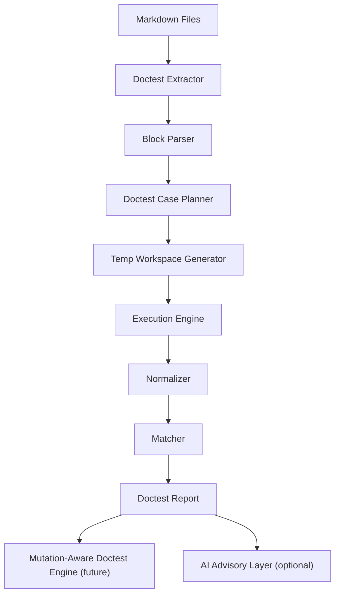
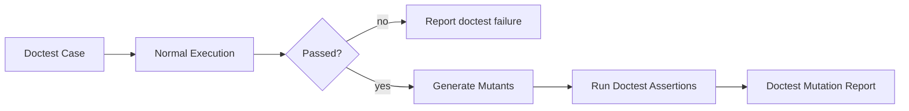

# Doctest Architecture

zentinel doctests turn documentation into executable specifications. They validate examples, CLI snippets, config snippets, report schemas, and eventually mutation-aware documentation examples.

The doctest subsystem is deterministic core behavior. AI may help suggest or explain doctests, but AI must never decide whether a doctest passed.

## Goals

- Validate documentation examples with real Zig/compiler behavior.
- Keep docs and implementation contracts synchronized.
- Give AI agents executable documentation conventions.
- Provide snapshot-friendly output for CLI, JSON, and text examples.
- Prepare for mutation-aware doctests through `zentinel doctest --mutate`.

## Non-Goals

- Replacing `zig test`.
- Executing arbitrary shell tutorials without explicit `bash cli` blocks.
- Inferring expected behavior from prose.
- Using AI as a doctest oracle.
- Supporting nondeterministic examples by default.

## System Overview

```text
Markdown docs
  -> doctest extractor
  -> block parser
  -> case planner
  -> temporary workspace generator
  -> Zig/CLI/config/report executor
  -> normalizer
  -> matcher
  -> deterministic report
  -> optional AI advisory explanation
```

Doctests are not separate from zentinel's architecture. They use the same config, runner, reporting, cache, and AI boundary principles as mutation testing.



## Module Placement

```text
zentinel
├─ CLI
│  └─ doctest command
├─ Docs / Doctest
│  ├─ extractor
│  ├─ block parser
│  ├─ case planner
│  ├─ workspace generator
│  ├─ normalizer
│  └─ matcher
├─ Runner
├─ Reporting
├─ Cache
├─ Mutation Engine
└─ AI Assistance Layer
```

Doctest modules may depend on:

- config
- runner
- report
- cache
- source/path normalization utilities

Doctest modules must not depend on:

- AI providers for pass/fail behavior
- experimental ZIR backends
- mutation execution unless `--mutate` is explicitly enabled

## Extraction Pipeline

1. Discover documentation files.
2. Read files as UTF-8.
3. Extract fenced code blocks with source location metadata.
4. Classify blocks by language and tag.
5. Group related blocks into doctest cases.
6. Validate each case has enough information to execute or match.
7. Produce a deterministic case list sorted by file path, block start line, and block index.

Extraction metadata:

```json
{
  "file": "docs/CLI_SPEC.md",
  "block_index": 3,
  "line_start": 47,
  "line_end": 52,
  "fence": "bash cli",
  "id": "dt_01hr7p6h0v2fj3drdzt9k2a0xe",
  "anchor_line": 47,
  "source_ref": "docs/CLI_SPEC.md:47:help-output",
  "block_refs": ["docs/CLI_SPEC.md:47:help-output", "docs/CLI_SPEC.md:54:help-output"]
}
```

`source_ref` is a case-level anchor, not a per-block identity. It always points at the first executable or producer block in the grouped case. Secondary expectation blocks are retained in `block_refs` for diagnostics and report display, but CLI source-ref selectors resolve only against the anchor line so expectation-line selectors cannot silently choose a producer. Examples use illustrative line numbers; executable fixtures must derive source refs from current extraction metadata rather than copying example line numbers.

## Parsing Strategy

Doctest parsing is Markdown-fence aware, not a full Markdown renderer.

Rules:

- Supported doctest fences use exactly three or four backticks.
- the opening fence info string is split into language plus tags
- indentation outside fences is ignored
- fenced content is preserved exactly before normalization
- malformed fences are reported as doctest extraction errors

The parser must preserve:

- project-relative documentation path
- block line numbers
- raw info string
- raw content
- normalized language
- normalized tag set

## Case Planning

Blocks become cases through deterministic grouping.

Standalone executable blocks:

- `zig test`
- `zig compile_fail`
- `bash cli`

Paired expectation blocks:

- `zig compile_fail` followed by `text output`
- `zig test` followed by `text output`
- `bash cli` followed by `text output`
- command block followed by `json expected`
- `toml config` followed by config validation expectation

`zig` followed by `text output` is invalid because plain compile-pass snippets have no stable stdout/stderr contract.

Mutation-spec blocks:

- `zig before` followed by `zig after`
- future `zentinel doctest --mutate` validates these through mutator behavior

Grouping rules:

1. A block with explicit case label starts or joins that label.
2. Without a label, an executable block may consume immediately following expectation blocks.
3. A blank prose section heading boundary ends implicit grouping.
4. Ambiguous grouping is an extraction error.
5. Duplicate unlabeled cases in one file with the same case kind, normalized grouping metadata, and grouped-block content hash are an extraction error. Add explicit labels to distinguish intentionally repeated examples.

## Execution Strategy

Doctest execution uses deterministic case types.

| Case type | Execution |
| --- | --- |
| Zig compile-pass | Write snippet into temp Zig file and compile/test it. |
| Zig test | Write snippet into temp Zig file and run `zig test`. |
| Zig compile-fail | Compile snippet and require failure matching expected diagnostics when provided. |
| CLI | Run zentinel command against temp workspace. |
| Config | Parse/validate config with zentinel config module. |
| JSON expected | Compare normalized JSON from preceding command or report producer. |
| Text output | Compare normalized text from preceding command. |
| Mutation pair | Future mutator-specific validation. |

Execution must be serial first. Parallel doctest execution is allowed later only when report ordering remains deterministic.

## Temporary Workspace Generation

Each executable doctest runs in an isolated workspace.

Workspace layout:

```text
.zig-cache/zentinel/doctest/
└─ <case-hash>/
   ├─ build.zig
   ├─ src/
   │  └─ doctest.zig
   ├─ zentinel.toml
   └─ expected/
```

Rules:

- workspace name is derived from durable case ID, block content hash, Zig version, and doctest engine version
- original repository files are never modified
- generated workspaces are safe to delete
- absolute paths are normalized out of snapshots
- symlink escape rules from `docs/SANDBOX_SECURITY.md` apply

## Zig Compiler Integration

Default Zig commands:

```bash
zig test src/doctest.zig
zig build test
zig build-exe src/doctest.zig
```

Doctest cases may choose the command through block type, not arbitrary prose.

Rules:

- pinned Zig `0.16.0` only
- compiler output is captured and bounded
- compile failures are expected only for `zig compile_fail`
- optimization mode defaults to `Debug`
- other modes are explicit future extensions

## Snapshot Strategy

Doctest snapshots normalize:

- absolute paths
- temp workspace names
- durations
- Zig cache paths
- line endings
- color output
- JSON object key order where supported

Snapshot match modes:

| Mode | Meaning |
| --- | --- |
| exact | normalized output must match exactly |
| contains | normalized output must contain expected lines in order |
| regex | normalized text output must match the documented regular expression |
| json | normalized JSON semantic comparison |
| json_subset | normalized JSON must contain the expected object or array subset |
| json_unordered | normalized JSON arrays or object entries may match without source-order significance where the block format permits it |
| diagnostic | compiler diagnostic comparison with normalized paths/lines |

Default:

```text
exact for text output
json for json expected
diagnostic for compile_fail diagnostics
```

## Deterministic Guarantees

Doctest runs must be reproducible for the same:

- repository content
- docs content
- Zig version
- zentinel version
- config
- command
- environment policy

Deterministic surfaces:

- case IDs
- case ordering
- workspace hash
- report ordering
- normalized output
- snapshot matching
- cache keys

## Caching Opportunities

Cache keys include:

- doctest engine version
- doc file path
- block line range
- block content hash
- grouped expectation hash
- Zig version
- command kind
- config hash

Cache entries may store:

- extraction results
- planned cases
- generated workspace metadata
- execution result
- normalized output

Cache entries must not store:

- AI advisory output as pass/fail evidence
- results from unsupported Zig versions
- outputs with unredacted secrets

## Future Mutation Integration

`zentinel doctest --mutate` will:

1. Run normal doctests.
2. Select mutation-aware doctest cases.
3. Generate mutants for documented snippets or referenced source.
4. Execute the doctest assertions against mutants.
5. Report killed/survived doctest mutants.

The mutation-aware path must use the shared `Mutant` model and normal result semantics. It must not create a separate mutation truth system.


